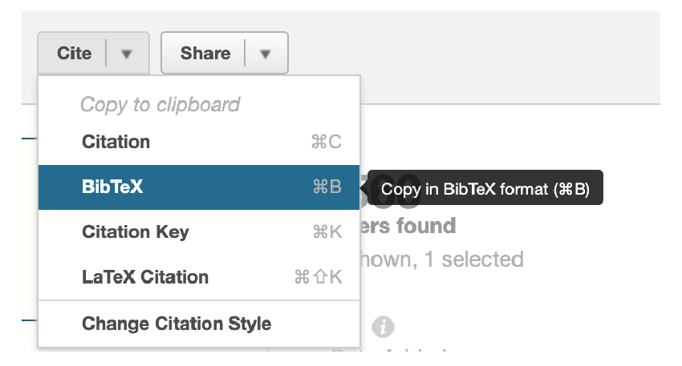

bib2coa
==============================
##### Latest release: V 1.1 (March 2021)

A command-line tool that converts a single bibtex file to a tab-separated file (TSV) with two columns (author, paper). This can be used as the foundations for a NSF-compliant COA file.

#### What does this do?
Makes a nice tab-separated file with author, <year>-paper title which can be easily edited to build a COA file. Removes duplicate authors (where names are perfectly duplicated) and sets up an initial skeleton that mostly saves you copying-and-pasting names from paper PDFs. 

#### What does this NOT do?
MANY things, including automatically getting author affiliations or anything like that. In general this is much easier to copy and paste (and just know).

## Install

To install [current stable version from PyPI](https://pypi.org/project/bib2coa/)

	pip install bib2coa

To install source clone this repository or download the zip file and unzip and run

	pip install .
	
From within the source dir tree (where `setup.py` is).

## Usage
To build a tab-separated file (TSV) from a bibtex file run

	bib2coa <filename>
	
This creates an outputfile called `coa_initial.tsv` which has two tab-separated columns. Unique authors (col 1) and the paper they come from with the paper year. 

To see stats on the conversion include `--stats` flag. 

To output a file with a different name add the `--output my_file.tsv` (for example).
		
		
## Recommended workflow
Below is the workflow we recommend for making an [NSF-compliant COA file](https://www.nsf.gov/bfa/dias/policy/coa.jsp).

#### 1. Build references
Use your reference manager (we recommend PaperPile) to select all the references you want to process and save them as a single bibtex file.   
For PaperPile, this is achieved by selecting all the papers you want to collect together and copy all the citations as bibtex keys to your clipboard. Save these as a text file (can be any format, but, in principle should have the `.bib` extension. Let's say we call this file `nsf.bib`.

#### 2. Run bib2coa on this file 

Run using command

	bib2coa --stats <filename>
	
e.g. in our example this would be

	bib2coa --stats nsf.bib
		
This generates the file `coa_initial.tsv`. This can be opened in Excel/Numbers, a tab delimiter used to define the colimns, and then you can edit this file to match the appropriate table in the [NSF COA template](https://www.nsf.gov/bfa/dias/policy/coa.jsp)

